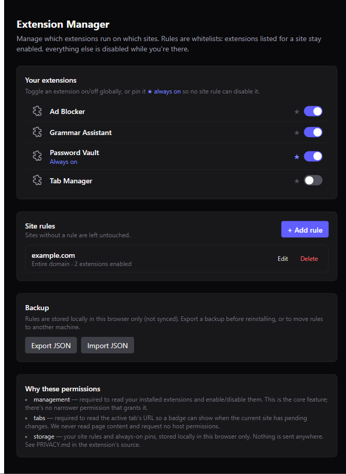

# Extension Manager

[](./LICENSE)

A browser extension that keeps *your other extensions* tidy on a per-site
basis. Tell it what should be enabled on a site — say, only your ad blocker
and password manager on your banking site — and it keeps everything else
switched off there.

Works in any Chromium-based browser: Chrome, Edge, Brave, Opera, Arc, and
more. It's built entirely on standard WebExtension APIs, nothing
browser-specific.



## What it does

- **Per-site whitelists.** Pick which extensions stay on for a domain or a
  single hostname — everything else gets switched off automatically while
  you're there.
- **Always-on pins.** Star an extension to keep it enabled everywhere, no
  matter what any site's rule says — handy for a password manager you never
  want to lose.
- **Nothing changes until you say so.** Sites without a rule are left
  completely alone.
- **Backup & restore.** Export your rules to JSON and bring them to another
  machine in a click.

## How it works

Open the toolbar popup on any site and Extension Manager instantly applies
that site's rule — switching extensions on or off to match, right then and
there. A badge on the icon lets you know when a site you're visiting has a
rule waiting to be applied, so you always know what's about to happen and
when.

## Getting started

Extension Manager isn't on the Chrome Web Store yet, so install it from
source:

```bash
npm install
npm run build
```

Then in your browser: go to `chrome://extensions`, turn on **Developer
mode**, click **Load unpacked**, and select the `.output/chrome-mv3` folder.

## Good to know

- Enabling/disabling an extension applies browser-wide, not per-tab — so the
  last site you synced is the one whose rule is currently active.
- Toggling an extension briefly restarts it, the same as flipping it on
  `chrome://extensions`.
- Rules live locally in your browser (not synced to your Google account).
  Use **Export JSON** on the Options page before switching machines or
  reinstalling.

## Privacy & permissions

No data collection, no network requests, no analytics — everything stays on
your device. See [PRIVACY.md](./PRIVACY.md) for the full breakdown of what
each permission is for.

## Development

```bash
npm run dev          # Chrome, with hot reload
npm run dev:firefox  # Firefox, with hot reload
npm test             # vitest, watch mode
npm run compile      # typecheck
npm run build        # production build -> .output/chrome-mv3
```

Contributions welcome — open an issue or a PR.

## License

[MIT](./LICENSE)
